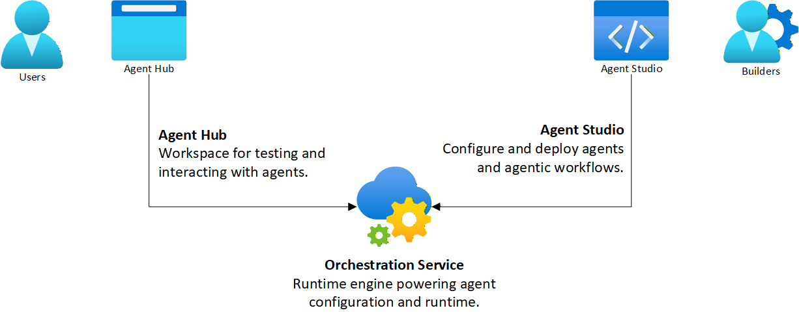

# FustatAI

[](https://opensource.org/licenses/Apache-2.0)

FustatAI is an open-source journey into learning, understanding, and experimenting with:

- Large Language Models (LLMs)
- Agentic AI
- Multi-agent systems
- Orchestration patterns
- Human‑in‑the‑loop workflows
- Vibe coding with multiple frontier LLMs

FustatAI is a sandbox environment for curiosity — to explore how AI agents and orchestration work, and how humans and LLMs can collaborate through reasoning, workflows, and tools.

## FustatAI Modules



### Agent Hub (Next.js)

A web-based workspace for interacting with agents. Agent Hub provides:

- Agent discovery & collaboration
- Human‑in‑the‑loop interactions
- UX & agent interaction flows

### Agent Studio (Next.js)

A builder’s environment for configuring, deploying, and experimenting with agents. Agent Studio provides a sandbox for:

- Authoring agents and agentic workflows
- Configuring MCP Server & LLM APIs
- Rapid experimentation and agents deployment iterations

### Orchestration Service (FastAPI + LangGraph)

A lightweight runtime engine powering agent execution. Orchestration Service enables:

- API-first interaction with Hub & Studio
- Multi-agent patterns and agents runtime
- Tool invocation
- Context routing
- Memory & state management

### Vibe Coding

A defining part of FustatAI is how it was built. The project grew through vibe coding using multiple frontier LLMs:

- Claude: used for frontend and UI development
- DeepSeek: backend development
- Gemini CLI: code reviews, debugging, and code fixing

## Tech Stack

Frontend (Agent Hub + Agent Studio)
- Next.js, shadcn/ui
- React, TypeScript, Tailwind

Backend (Orchestration Service)
- Python, FastAPI, PostgreSQL
- LangGraph, LangChain

LLM / Agent Integrations
- LLM‑agnostic (supports API models + local models)
- MCP (Model Context Protocol) support
- Orchestrator / Supervisor Multi-Agent Pattern 

## Getting Started

### 1. Clone the repository

```bash
git clone https://github.com/wtamimi/fustatai.git
cd fustatai
```

## 2. Repo Structure and Setup Instructions

Each module contains its own README with setup instructions.

```bash
src/
  hub/           # Agent Hub (Next.js)
    README.md    # Agent Hub setup instructions
  studio/        # Agent Studio (Next.js)
    README.md    # Agent Studio setup instructions
  orchestrator/  # Orchestration Service (FastAPI + LangGraph)
    README.md    # Orchestration Service setup instructions
```

### 3. Recommended run order

1. Orchestration Service — uvicorn
2. Agent Studio — npm
3. Agent Hub — npm

## Fun Facts

FustatAI project name is inspired by Fustat, the first capital of Egypt and the foundational city for modern Cairo.

## The Journey

FustatAI has undergone three major ports as part of its exploration and learning journey:

1. OpenAI Agents SDK — the first experimental version
2. Google ADK — the second experimental prototype
3. LangGraph — the current architecture for agent orchestration

### Next Steps

FustatAI is still in an MVP and exploration stage, with plenty of room to grow.

If you have ideas, suggestions, or areas you’d like to see enhanced, then please open an issue and share your thoughts — your input helps shape the journey.

### Join the Journey

If you’re curious about LLMs, agents, orchestration, or vibe coding, then:
Fork the repo. Experiment. Learn and Share.

Welcome to FustatAI.
